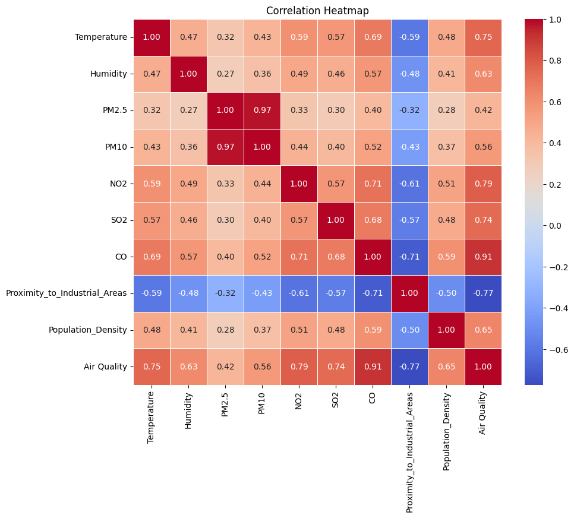
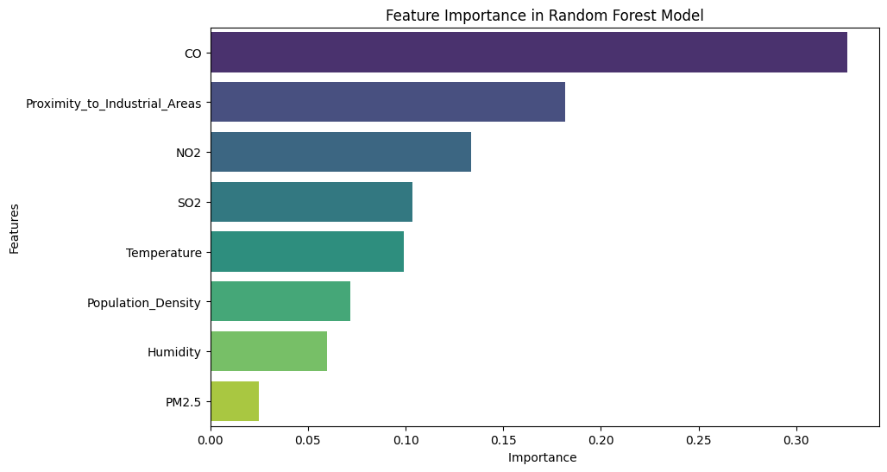
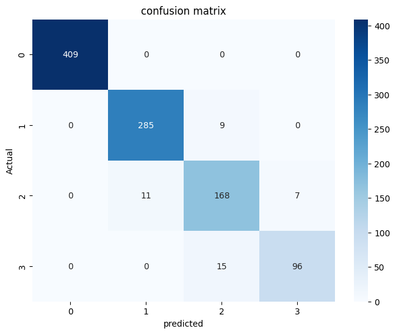

# 🌍 Air Quality Prediction using Machine Learning

## 📌 Project Overview
This project aims to build a robust Machine Learning pipeline that predicts the air quality category (**Good, Moderate, Poor, Hazardous**) based on environmental factors and gas pollutant levels. 

By analyzing various pollutants and demographic data, we trained and compared multiple ensemble models to find the most accurate predictor for air quality.

## 🛠️ Technologies Used
* **Programming Language:** Python
* **Data Manipulation:** Pandas, NumPy
* **Machine Learning:** Scikit-Learn, XGBoost
* **Data Visualization:** Seaborn, Matplotlib

## ⚙️ Project Pipeline
1. **Data Exploration (EDA):** Loaded the dataset and created visual charts (Boxplots, Heatmaps) to understand feature distributions and correlations.
2. **Data Preprocessing:** * Encoded categorical labels.
   * Addressed **Multicollinearity** by removing highly correlated columns (e.g., dropping `PM10` which was 97% correlated with `PM2.5`).
   * Split the data into Training and Testing sets *before* scaling to **prevent Data Leakage**.
   * Applied feature scaling (Standardization).
3. **Modeling & Comparison:** Trained and evaluated three powerful ensemble models:
   * Random Forest Classifier
   * Gradient Boosting Classifier
   * XGBoost Classifier
4. **Deployment Prep:** Saved the winning model and the scaler into `.pkl` files for future deployment.

## 🚧 Challenges & Solutions
* **Class Imbalance:** The dataset had significantly more "Good" air samples than "Hazardous" ones. Handled this internally during modeling using `class_weight='balanced'` to ensure fair predictions across all classes.
* **Multicollinearity:** The correlation heatmap revealed that PM2.5 and PM10 were almost identical. Dropped the `PM10` column to reduce noise and improve model efficiency without losing information.

## 📊 Key Visualizations & Insights

### 1. Correlation Heatmap

> **Insight:** This heatmap shows a very strong positive correlation (0.91) between CO levels and Air Quality, and a 0.97 correlation between PM2.5 and PM10, which led to dropping PM10.

### 2. Feature Importance

> **Insight:** Carbon Monoxide (CO) and Proximity to Industrial Areas are the dominant features driving the model's predictions.

### 3. Confusion Matrix

> **Insight:** The model is highly accurate, specifically in predicting the "Good" (0) air quality class with 100% precision, showing very few misclassifications between adjacent classes.

## 🏆 Final Results & Model Selection
After comparing the models, **XGBoost Classifier** outperformed the others.
* **XGBoost Accuracy:** 95.9% 🥇
* **Random Forest Accuracy:** 95.8%
* **Gradient Boosting Accuracy:** 95.3%

We selected **XGBoost** as our final winning model and saved it as `air_quality_xgb_model.pkl` along with the `scaler.pkl` for future use.

## 🚀 How to Run the Project
1. Clone this repository:
   ```bash
   git clone [https://github.com/your-username/Air-Quality-Prediction-ML.git](https://github.com/your-username/Air-Quality-Prediction-ML.git)

2. Install the required libraries:
   ```bash
   pip install pandas numpy scikit-learn xgboost matplotlib seaborn
Open the Jupyter Notebook air_quality.ipynb to view the code and run the cells.

🔮 Future Work
Deploy the saved XGBoost model as an interactive Web Application using Streamlit.
